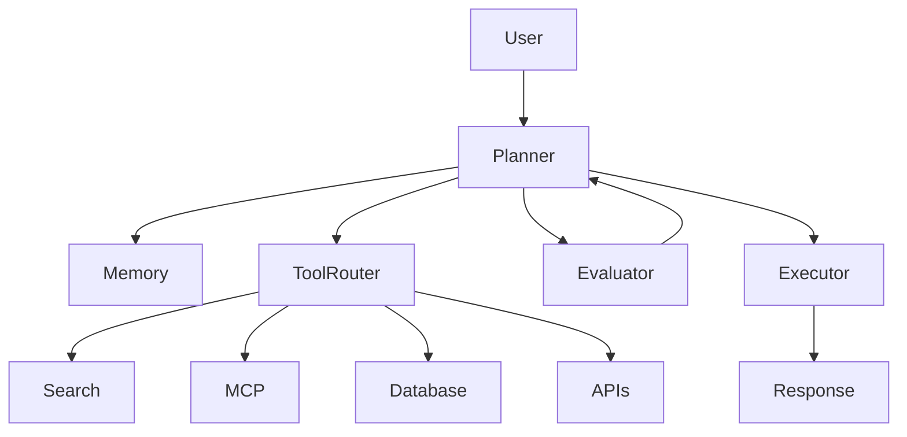

# 🤖 Puligilla Yashwanth

<div align="center">


[](https://git.io/typing-svg)


</div>

---

# 🧠 AI Dashboard

| Status | Value |
|---------|-------|
| 🚀 Current Project | AgentSkillOS |
| 🧠 Specialization | Agentic AI |
| ⚡ Backend | FastAPI |
| 🔄 Orchestration | LangGraph |
| 💾 Database | PostgreSQL |
| 🐳 Deployment | Docker |
| 📚 Learning | MCP · AI Evals · Multi-Agent |

---

# 👨‍💻 About Me

I build **AI systems that plan, reason, remember, call tools and complete real-world tasks.**

My current focus is building **AgentSkillOS**, an AI-native learning operating system powered by autonomous agents.

---

# 🏗 Multi-Agent Architecture



---

# 🚀 Featured Projects

## 🤖 AgentSkillOS
- Multi-agent orchestration
- Personalized learning
- Long-term memory
- LangGraph workflows
- FastAPI backend

---

## 💰 Prospera AI
AI-powered Wealth Operating System

- Financial assistant
- Budget analytics
- Portfolio insights

---

## ♻️ CCOS
Circular Commerce Operating System

- Digital Product Passport
- Return Intelligence
- Sustainability Analytics

---

## 🔍 Composio API Research Agent

- Autonomous API discovery
- Firecrawl integration
- Structured documentation

---

# 🛠 Tech Stack

## Languages

<p align="center">

</p>

## AI & Backend

<p align="center">

</p>

### AI Libraries

- LangGraph
- LangChain
- OpenAI
- Gemini
- PydanticAI

---

# 📊 GitHub Analytics

<p align="center">


</p>

<p align="center">

</p>

<p align="center">

</p>

<p align="center">

</p>

---

# 💭 Engineering Principles

```python
while building_agents:
    plan()
    use_tools()
    remember()
    evaluate()
    improve()
```

> "An autonomous agent is more than an LLM—it is planning, memory, tools, and evaluation working together."

---

# 📈 2026 Roadmap

- ✅ LangGraph
- ✅ FastAPI
- ✅ Docker
- ✅ PostgreSQL
- ✅ Multi-Agent Systems
- 🔄 MCP
- 🔄 AI Evaluations
- 🎯 Distributed Agents

---

# 🤝 Connect

<p align="center">

<a href="https://yashwanthai.dev">

</a>

<a href="https://github.com/Yashwanth112004">

</a>

<a href="https://www.linkedin.com/in/yashwanth-puligilla/">

</a>

</p>

---

<div align="center">


</div>
