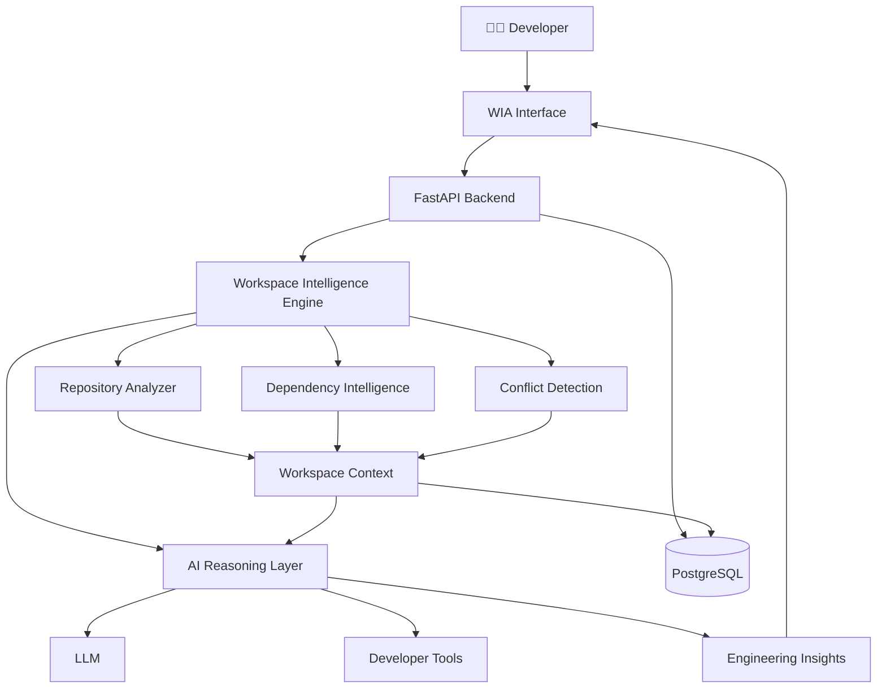

# 🤖 Puligilla Yashwanth

<div align="center">


<br/>

<a href="https://yashwanthai.dev">

</a>
&nbsp;
<a href="https://github.com/Yashwanth112004">

</a>
&nbsp;
<a href="https://www.linkedin.com/in/yashwanth-puligilla/">

</a>

<br/><br/>


</div>

---

<div align="center">

### ⚡ Building systems where AI understands the workspace — not just the prompt.

</div>

---

# 🧠 About Me

I'm **Puligilla Yashwanth**, an AI and software engineering enthusiast focused on building intelligent software systems, backend platforms, and developer tools.

My work combines:

- 🤖 AI-powered applications
- 🔍 Repository & developer intelligence
- ⚙️ Backend engineering
- 🧠 LLM reasoning systems
- 🔄 AI workflows and orchestration
- 🔌 Tool integrations & MCP
- 🔐 Secure and privacy-aware architectures
- ⛓️ Decentralized systems

I enjoy taking systems from **architecture → implementation → integration → deployment**.

---

# 🚀 Current Project

<div align="center">

# 🔍 Workspace Intelligence Agent

### **WIA**

**AI-powered developer intelligence platform**

<br/>


</div>

<br/>

**Workspace Intelligence Agent (WIA)** is an AI-powered developer intelligence platform designed to understand software repositories at a deeper level.

Instead of treating a codebase as a collection of isolated files, WIA builds structured workspace context that can be used by AI systems to reason about the project.

### 🎯 Core Idea

```text
                 ┌───────────────────────┐
                 │       DEVELOPER       │
                 └───────────┬───────────┘
                             │
                             ▼
                 ┌───────────────────────┐
                 │      WIA WORKSPACE    │
                 │      INTELLIGENCE     │
                 └───────────┬───────────┘
                             │
          ┌──────────────────┼──────────────────┐
          ▼                  ▼                  ▼
     Repository         Dependency          Project
      Analysis          Intelligence        Context
          │                  │                  │
          └──────────────────┼──────────────────┘
                             ▼
                 ┌───────────────────────┐
                 │   AI REASONING LAYER  │
                 └───────────┬───────────┘
                             │
                             ▼
                 ┌───────────────────────┐
                 │ ENGINEERING INSIGHTS  │
                 └───────────────────────┘
```

---

# 🧩 WIA Capabilities

### 📁 Repository Intelligence

WIA analyzes the structure and composition of a software repository.

- Repository structure
- Source files
- Configuration
- Project metadata
- Framework detection
- Technology identification
- Internal relationships

### 📦 Dependency Intelligence

Understand how dependencies interact within a project.

- Dependency discovery
- Dependency relationships
- Version analysis
- Compatibility analysis
- Potential dependency conflicts
- Package-level intelligence

### ⚠️ Conflict Detection

WIA is designed to identify potential engineering conflicts across a workspace.

```text
Dependency
    ↓
Version Relationship
    ↓
Compatibility Check
    ↓
Potential Conflict
    ↓
AI Analysis
    ↓
Developer Recommendation
```

### 🧠 AI Reasoning

The intelligence layer combines repository context with LLM reasoning.

```text
Repository
     │
     ▼
Static Analysis
     │
     ▼
Structured Context
     │
     ▼
AI Reasoning
     │
     ├── Understand
     ├── Analyze
     ├── Correlate
     └── Explain
     │
     ▼
Developer Insight
```

---

# 🏗️ WIA Architecture


```mermaid
flowchart TB

    Developer["👨‍💻 Developer"]

    Developer --> Interface["WIA Interface"]

    Interface --> API["FastAPI Backend"]

    API --> Orchestrator["Workspace Intelligence Engine"]

    Orchestrator --> Repository["Repository Analyzer"]
    Orchestrator --> Dependency["Dependency Intelligence"]
    Orchestrator --> Conflict["Conflict Detection"]
    Orchestrator --> Reasoning["AI Reasoning Layer"]

    Repository --> Context["Workspace Context"]
    Dependency --> Context
    Conflict --> Context

    Reasoning --> LLM["LLM"]
    Reasoning --> Tools["Developer Tools"]

    Context --> Reasoning

    Reasoning --> Insights["Engineering Insights"]

    Insights --> Interface

    Database[("PostgreSQL")]

    API --> Database
    Context --> Database
```

---

# 🧬 WIA System Flow

<div align="center">


</div>

<br/>

| Layer | Responsibility |
|---|---|
| 📁 Repository Layer | Understand project structure |
| 🔍 Analysis Layer | Extract repository intelligence |
| 📦 Dependency Layer | Analyze package relationships |
| ⚠️ Conflict Layer | Detect potential engineering issues |
| 🧠 AI Layer | Reason over workspace context |
| 🔌 Tool Layer | Connect external developer capabilities |
| 💾 Data Layer | Persist workspace information |
| 🖥️ Interface | Deliver actionable developer insights |

---

# 🌌 WIA — 3D Architecture Visualization

<div align="center">


<br/><br/>

<table>
<tr>
<td align="center">
<h3>📁 Repository</h3>
<p>Structure<br/>Source<br/>Configuration</p>
</td>

<td align="center">➜</td>

<td align="center">
<h3>🧠 WIA Core</h3>
<p>Context<br/>Reasoning<br/>Intelligence</p>
</td>

<td align="center">➜</td>

<td align="center">
<h3>🤖 AI</h3>
<p>Analysis<br/>Correlation<br/>Insights</p>
</td>

<td align="center">➜</td>

<td align="center">
<h3>👨‍💻 Developer</h3>
<p>Actions<br/>Decisions<br/>Workflow</p>
</td>
</tr>
</table>

</div>

---

# 🔮 Future Direction of WIA

WIA is being developed toward a broader AI-native developer workspace.

### Planned areas

- 🧩 VS Code integration
- 🔍 Intelligent codebase search
- 🧠 Workspace-aware AI
- 🤖 Developer agents
- 📦 Advanced dependency intelligence
- ⚠️ Automated conflict analysis
- 🔌 MCP integration
- 🛠️ Tool calling
- 🐛 Intelligent debugging assistance
- 📊 Repository analytics
- 🔄 AI-assisted engineering workflows

---

# 🛡️ OjasRaksha

## Decentralized Healthcare Data & Consent Platform

**OjasRaksha** is a privacy-focused healthcare platform built around decentralized infrastructure, consent management, secure medical records, and interoperability.

The project explores how sensitive healthcare information can remain protected while enabling **verifiable consent and data integrity**.

### Core Technologies

- ⛓️ Hedera Hashgraph
- 📦 Pinata IPFS
- 🔐 AES-256-GCM
- #️⃣ SHA-256
- 🔑 RBAC
- 🔐 HashiCorp Vault Transit Engine
- 🏥 HL7 FHIR R4
- 🩺 ICD-10
- 📜 DPDP Act 2023

### Architecture

```text
                 PATIENT / PROVIDER
                         │
                         ▼
              ┌─────────────────────┐
              │   OJASRAKSHA APP    │
              └──────────┬──────────┘
                         │
              ┌──────────┴──────────┐
              ▼                     ▼
       Identity / RBAC        Consent Engine
              │                     │
              ▼                     ▼
       Encryption Layer      Hedera HCS
              │                     │
              ▼                     ▼
       Pinata IPFS           Consent Audit
              │
              ▼
      Encrypted Medical Data
```

### Experimental Measurements

| Metric | Measurement |
|---|---:|
| Average Transaction Latency | **2.12 s** |
| Consent Grant Latency | **2.42 s** |

The project also uses a synthetic clinical and cryptographic test dataset structured around **FHIR R4, WHO ICD-10-CM, and DPDP Act 2023 considerations**.

---

# 💰 Prospera

## AI-Powered Wealth Operating System

Prospera is an AI-powered personal finance platform combining financial management, analytics, AI assistance, and simulation.

### Features

- 💳 Expense management
- 📊 Budget analytics
- 📈 Investment insights
- 🤖 AI Financial Copilot
- 🧠 LLM-powered financial assistants
- 🧬 Digital Twin simulations
- 📄 OCR-based document processing
- 🔐 JWT authentication
- 🔒 AES-256 encryption
- 📱 Mobile application

### Architecture

```text
                   USER
                    │
                    ▼
             ┌──────────────┐
             │   PROSPERA   │
             └──────┬───────┘
                    │
        ┌───────────┼───────────┐
        ▼           ▼           ▼
     Expenses    Budgets    Investments
        │           │           │
        └───────────┼───────────┘
                    ▼
             AI FINANCIAL
               COPILOT
                    │
                    ▼
                LLM + Tools
                    │
                    ▼
          Financial Intelligence
```

**Stack:** React · TypeScript · Node.js · PostgreSQL · OpenAI · LangChain · JWT · OCR

---

# ♻️ Circular Commerce Operating System

## CCOS

CCOS is a circular commerce platform designed around the problem of **e-commerce returns and product lifecycle management**.

Rather than treating returned products as an endpoint, the platform explores ways to determine their next lifecycle.

### Components

#### 🔄 Return Intent Predictor

Uses signals such as:

- Customer history
- Product category
- Product price
- Browsing behavior
- Purchase context

to estimate return behavior.

#### 👤 Next Best Owner Engine

Identifies potential next owners for returned products using product and customer signals.

### Platform Concepts

- 🪪 Digital Product Passport
- 🔄 Return Intelligence
- 🤖 Resale Intelligence
- 🌱 Sustainability Analytics
- 📦 Product Lifecycle Intelligence
- 💳 Digital Wallet
- 🧬 Product Twin
- 📊 Circular Commerce Command Center

### Lifecycle

```text
                PRODUCT
                   │
                   ▼
             DIGITAL PASSPORT
                   │
                   ▼
                PURCHASE
                   │
                   ▼
                 USAGE
                   │
                   ▼
                RETURN
                   │
                   ▼
          RETURN INTELLIGENCE
                   │
                   ▼
          PRODUCT ASSESSMENT
                   │
                   ▼
         NEXT BEST OWNER ENGINE
             /      |       \
            /       |        \
           ▼        ▼         ▼
        RESALE   DONATION   RECYCLE
           \        |        /
            \       |       /
             ▼      ▼      ▼
             CIRCULAR LIFECYCLE
```

---

# 💼 Experience

## Accenture

### Associate Software Engineer Intern

**May 2026 – July 2026**

Worked on **Prospera**, an AI-powered financial platform.

### Technologies & Areas

- React.js
- TypeScript
- Node.js
- PostgreSQL
- Generative AI
- AI assistants
- PowerApps
- Power Automate
- Enterprise automation
- AI workflows

During the internship, also gained exposure to **agentic AI, MCP concepts, Generative AI, and AI orchestration**.

---

# 🛠️ Technical Stack

<div align="center">

## Languages


<br/><br/>

## Frontend


<br/><br/>

## Backend


<br/><br/>

## Databases


<br/><br/>

## DevOps


</div>

---

# 🧠 AI & Developer Technologies

<div align="center">


</div>

---

# ⛓️ Blockchain & Decentralized Technology

<div align="center">


</div>

---

# 🔐 Security & Architecture

Areas I've worked with across projects:

- AES-256-GCM encryption
- SHA-256 integrity verification
- JWT authentication
- Role-Based Access Control
- Zero-trust architecture
- HashiCorp Vault Transit
- Secure API design
- Decentralized storage
- Consent-based access
- Data integrity verification

---

# 🧩 Engineering Focus

```text
┌──────────────────────────────────────────────────┐
│                  SOFTWARE SYSTEMS                │
├──────────────────────────────────────────────────┤
│                                                  │
│     AI / LLM              BACKEND               │
│        │                     │                   │
│        ▼                     ▼                   │
│   AI Reasoning          APIs / Services          │
│        │                     │                   │
│        └──────────┬──────────┘                   │
│                   ▼                              │
│             DATA SYSTEMS                         │
│                   │                              │
│                   ▼                              │
│          DEVELOPER WORKFLOWS                     │
│                   │                              │
│                   ▼                              │
│          PRODUCTION SYSTEMS                      │
│                                                  │
└──────────────────────────────────────────────────┘
```

---

# 📌 Selected Technologies

| Category | Technologies |
|---|---|
| **Languages** | Python, Java, C, JavaScript, TypeScript, SQL |
| **Frontend** | React, TypeScript, Tailwind CSS, Vite |
| **Backend** | FastAPI, Node.js, Spring Boot, Flask |
| **AI** | LangGraph, LangChain, OpenAI, Gemini, OpenRouter, PydanticAI |
| **AI Infrastructure** | MCP, Tool Calling, Agent Workflows |
| **Databases** | PostgreSQL, MongoDB, MySQL, SQLite |
| **DevOps** | Docker, GitHub Actions, Jenkins, Linux, Bash |
| **Blockchain** | Hedera, IPFS, Pinata |
| **Security** | AES-256-GCM, JWT, RBAC, Vault Transit |

---

# 🌐 Find Me Online

<div align="center">

<a href="https://yashwanthai.dev">

</a>

<br/><br/>

<a href="https://github.com/Yashwanth112004">

</a>

<br/><br/>

<a href="https://www.linkedin.com/in/yashwanth-puligilla/">

</a>

</div>

---

<div align="center">


### Building intelligent systems, one layer at a time.

**AI Engineering · Developer Intelligence · Backend Systems · Decentralized Technology**

</div>
