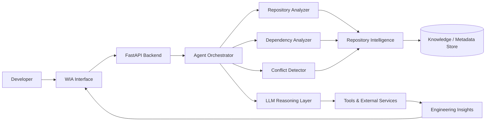
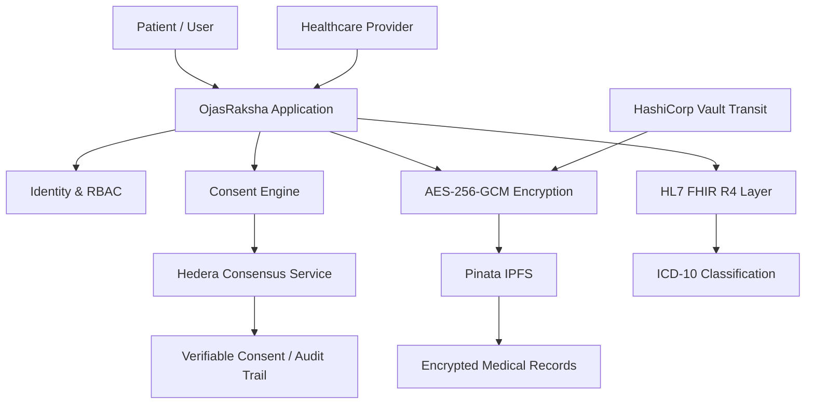
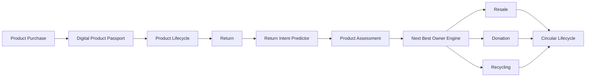

# 🤖 Puligilla Yashwanth

<div align="center">

### Agentic AI Engineer · Backend Engineer · AI Systems Builder

**Building intelligent systems that reason, use tools, interact with data, and solve real engineering problems.**

<p>
  <a href="https://yashwanthai.dev">
    
  </a>
  <a href="https://github.com/Yashwanth112004">
    
  </a>
  <a href="https://www.linkedin.com/in/yashwanth-puligilla/">
    
  </a>
</p>

</div>

---

## 👋 About Me

I'm **Puligilla Yashwanth**, an AI and software engineering enthusiast focused on building **agentic systems, intelligent developer tools, backend platforms, and AI-powered applications**.

My work sits at the intersection of:

* 🤖 **Agentic AI & LLM Applications**
* 🧠 **Multi-Agent Systems**
* 🔄 **Agent Orchestration & Tool Calling**
* 🔌 **MCP & AI Tool Integration**
* ⚙️ **Backend Engineering**
* 🗄️ **Distributed Data & APIs**
* 🔐 **Security & Privacy**
* ⛓️ **Blockchain & Decentralized Systems**

I enjoy taking an idea from **architecture → implementation → integration → deployment**, rather than building isolated AI demos.

---

# 🚀 What I'm Building

## 🔍 Workspace Intelligence Agent — WIA

**An AI-powered developer intelligence platform for understanding and analyzing software repositories.**

WIA is designed to act as an intelligent layer over a codebase, helping developers understand repository structure, dependencies, relationships, and potential engineering conflicts.

### Core capabilities

* 🧠 AI-powered repository intelligence
* 🔍 Codebase and repository analysis
* 📦 Dependency analysis and management
* ⚠️ Dependency / configuration conflict detection
* 🗂️ Repository structure understanding
* 🔄 Intelligent developer workflows
* 🤖 AI-assisted engineering analysis
* 🔌 Agent and tool integration
* 🧩 Designed for future VS Code integration

### Architecture


```mermaid
flowchart LR

    U[Developer]

    U --> UI[WIA Interface]

    UI --> API[FastAPI Backend]

    API --> ORCH[Agent Orchestrator]

    ORCH --> REPO[Repository Analyzer]
    ORCH --> DEP[Dependency Analyzer]
    ORCH --> CONFLICT[Conflict Detector]
    ORCH --> AI[LLM Reasoning Layer]

    REPO --> DATA[Repository Intelligence]
    DEP --> DATA
    CONFLICT --> DATA

    DATA --> DB[(Knowledge / Metadata Store)]

    AI --> TOOLS[Tools & External Services]
    TOOLS --> RESULT[Engineering Insights]

    RESULT --> UI
```

### Focus

> Turning a software repository into an **intelligent, queryable engineering workspace**.

**Stack:** Python · FastAPI · AI/LLMs · Agentic Workflows · PostgreSQL · Docker · ScyllaDB

---

# 🛡️ OjasRaksha

## Decentralized Healthcare Data & Consent Platform

**OjasRaksha** is a privacy-focused healthcare platform designed around decentralized identity, consent management, secure medical records, and interoperability.

Built using **Hedera Hashgraph and IPFS**, the system explores how healthcare data can remain private while still providing verifiable consent and integrity.

### Key capabilities

* 🏥 Healthcare record management
* 🔐 Zero-trust security architecture
* 🔑 Fine-grained RBAC
* 🧾 Patient consent management
* ⛓️ Hedera Consensus Service
* 📦 IPFS-based decentralized storage
* 🔒 AES-256-GCM encryption
* #️⃣ SHA-256 integrity verification
* 🩺 HL7 FHIR R4 interoperability
* 🏷️ ICD-10 classification
* 📜 DPDP Act 2023-oriented architecture
* 🔐 HashiCorp Vault Transit Engine
* 📊 Cryptographic and transaction benchmarking

### Architecture


```mermaid
flowchart TD

    Patient[Patient / User]
    Doctor[Healthcare Provider]
    App[OjasRaksha Application]

    Patient --> App
    Doctor --> App

    App --> Auth[Identity & RBAC]
    App --> Consent[Consent Engine]

    App --> Encrypt[AES-256-GCM Encryption]

    Encrypt --> IPFS[Pinata IPFS]
    Consent --> HCS[Hedera Consensus Service]

    App --> FHIR[HL7 FHIR R4 Layer]
    FHIR --> ICD[ICD-10 Classification]

    Vault[HashiCorp Vault Transit] --> Encrypt

    HCS --> Audit[Verifiable Consent / Audit Trail]
    IPFS --> Records[Encrypted Medical Records]
```

### Experimental measurements

| Measurement                 |     Result |
| --------------------------- | ---------: |
| Average Transaction Latency | **2.12 s** |
| Consent Grant Latency       | **2.42 s** |

The project also includes a synthetic clinical and cryptographic test dataset based around **FHIR R4, WHO ICD-10-CM, and DPDP Act 2023 requirements**.

**Stack:** Hedera Hashgraph · IPFS · Pinata · FHIR R4 · AES-256-GCM · HashiCorp Vault · RBAC

---

# 💰 Prospera

## AI-Powered Wealth Operating System

Prospera is an AI-powered personal finance platform designed to combine **financial management, analytics, AI assistance, and simulation** into a single system.

### Features

* 💳 Expense management
* 📊 Budget analytics
* 📈 Investment insights
* 🤖 AI Financial Copilot
* 🧠 LLM-powered financial assistants
* 🧬 Digital Twin simulations
* 📄 OCR-based document processing
* 🔐 JWT authentication
* 🔒 AES-256 encryption
* 📱 Mobile application
* 🗄️ PostgreSQL-backed architecture

### AI Layer

```text
User
  ↓
Financial Context
  ↓
AI Copilot
  ↓
LLM Reasoning
  ↓
Financial Tools
  ├── Expenses
  ├── Budgets
  ├── Investments
  └── Simulations
  ↓
Actionable Insights
```

**Stack:** React · TypeScript · Node.js · PostgreSQL · OpenAI · LangChain · JWT · OCR

---

# ♻️ Circular Commerce Operating System — CCOS

A technology platform focused on improving the economics and sustainability of **e-commerce returns**.

Instead of treating a returned product as waste, CCOS attempts to determine its **next-best lifecycle**.

### Core components

#### Return Intent Predictor

Predicts the likelihood of a customer returning a product using signals such as:

* Customer history
* Product category
* Price
* Browsing behavior
* Purchase context

#### Next Best Owner Engine

Determines potential next owners for returned products using product and customer signals.

### Platform capabilities

* 📦 Digital Product Passport
* 🔄 Return intelligence
* 🤖 Resale intelligence
* 🧠 Product lifecycle intelligence
* 🌱 Sustainability analytics
* 💳 Digital wallet concepts
* 🪪 Product identity / twin concepts
* 📊 Circular commerce command center

### Conceptual flow


```mermaid
flowchart LR

    Purchase[Product Purchase]

    Purchase --> Passport[Digital Product Passport]

    Passport --> Usage[Product Lifecycle]

    Usage --> Return[Return]

    Return --> RIP[Return Intent Predictor]

    RIP --> Inspection[Product Assessment]

    Inspection --> NBO[Next Best Owner Engine]

    NBO --> Resale[Resale]
    NBO --> Donation[Donation]
    NBO --> Recycle[Recycling]

    Resale --> Circular[Circular Lifecycle]
    Donation --> Circular
    Recycle --> Circular
```

**Focus:** Circular Economy · AI Decision Systems · Product Intelligence · Sustainability

---

# 🤖 Agentic AI & AI Systems

My current technical interests include building AI systems that go beyond simple prompt → response workflows.

### Areas I'm working with

```text
LLM
 │
 ├── Planning
 ├── Reasoning
 ├── Tool Calling
 ├── Memory
 ├── Retrieval
 ├── Multi-Agent Coordination
 ├── Evaluation
 └── External APIs
```

### Technologies

* **LangGraph**
* **LangChain**
* **OpenAI API**
* **Gemini API**
* **OpenRouter**
* **MCP**
* **PydanticAI**
* **FastAPI**
* **PostgreSQL**

I'm particularly interested in:

* Agent orchestration
* Stateful workflows
* Tool-use agents
* Multi-agent architectures
* Agent evaluation
* MCP servers
* Reliable AI systems
* AI developer tools

---

# 🧪 Other AI Work

### Composio API Research Agent

An experimental agent focused on autonomous API discovery and structured documentation workflows.

**Explored:**

* API discovery
* Tool selection
* Firecrawl integration
* Documentation extraction
* Structured API information
* Agent-driven research workflows

---

# 💼 Experience

### Accenture — Associate Software Engineer Intern

**May 2026 – July 2026**

Worked on **Prospera**, an AI-powered financial platform.

Worked with:

* React.js
* TypeScript
* Node.js
* PostgreSQL
* Generative AI
* AI assistants
* Financial workflows
* PowerApps
* Power Automate

Also explored concepts around:

* Agentic AI
* MCP
* AI orchestration
* Generative AI
* Enterprise automation

---

# 🛠️ Technical Stack

<div align="center">

### Languages


### Backend & Frameworks


### AI / Agentic AI


**LangGraph · LangChain · OpenAI · Gemini · OpenRouter · PydanticAI · MCP**

### Databases


### DevOps & Engineering


</div>

---

# 🏗️ Engineering Interests

```text
Agentic AI
    ↓
Multi-Agent Systems
    ↓
Tool Calling & MCP
    ↓
Reliable Backend Systems
    ↓
Distributed Data
    ↓
AI Developer Infrastructure
```

I'm especially interested in the engineering problems behind AI systems:

* How agents maintain state
* How tools are selected and executed
* How agents recover from failures
* How multi-agent systems coordinate
* How AI systems are evaluated
* How AI applications scale
* How to make autonomous workflows reliable
* How AI can improve developer productivity

---

# 📚 Currently Exploring

* MCP server architecture
* Agent evaluation
* Multi-agent orchestration
* AI developer tools
* Distributed agent systems
* LLM application architecture
* Reliable tool-calling systems
* Production AI infrastructure

---

# 🔗 Connect

<div align="center">

<a href="https://yashwanthai.dev">

</a>

<a href="https://github.com/Yashwanth112004">

</a>

<a href="https://www.linkedin.com/in/yashwanth-puligilla/">

</a>

</div>

---

<div align="center">

### Building AI systems that are useful beyond the chat window.

**Agentic AI · Backend Engineering · Developer Intelligence · Decentralized Systems**

</div>


</div>
